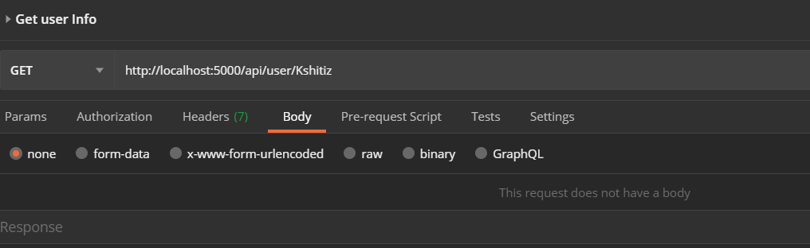
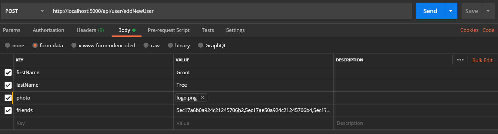
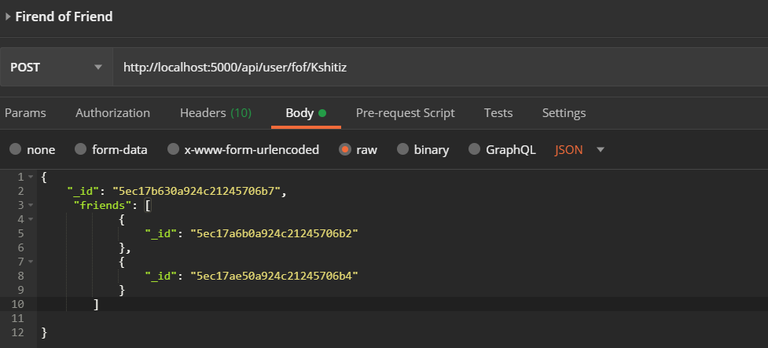
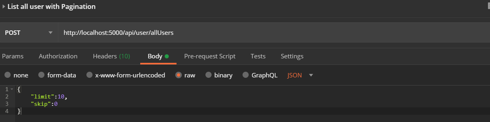
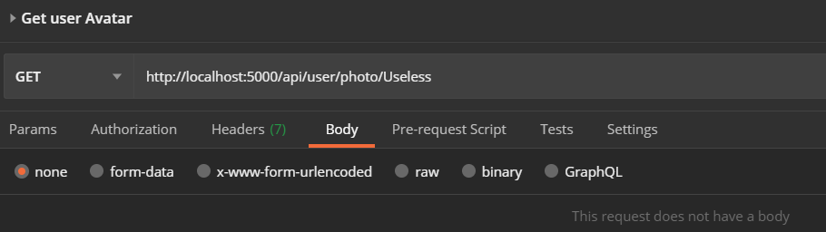
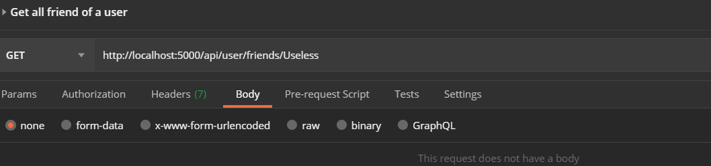

# Friend App
Know your Friend and  make new friends.

## Table of Content
* [General info](#general-info)
* [Technologies](#technologies)
* [Setup](#setup)
* [Features](#features)
* [API](#api)
* [PostMan Testing](#postman-testing)
* [Database Schema](#database-schema)
* [Testing](#testing)

## General info
This is a sample app for round 2 for CodeMyMobile interview.The goal was to create Rest APIs and a SPA to run those APIs.

## Technologies
Project is created with:
* NodeJS: 12.13.1
* MongoDB: 4.2.6
* ExpressJS: 4.17.1
* NextJS: 9.4.1
* ReactJS: 16.13.1

## Setup
To run this project, install it locally using npm:

```
$ cd frontend
$ npm install
$ cd ..
$ cd backend
$ npm install
$ npm run dev

```

## Features 

* A new User can be added at will. The fields include First Name, Last Name and Avatar.The user needs to pick atleast one friend.
* A progress bar is added to each page to show thw progess and let user know that something is happening.
* When a User A adds User B as a friend, the same is also reflected in the profile of user B which will show User A as his friend.
* Basic pagination is added. At one time only 5 users are shown on frontPage, we can get more profiles using Load More buton.
* Any user have the ability to see friends of his friends who are not mutual to them.


## API

There are total 7 API endpoints to get data.

* Landing Page

```
@@Method: Get 
@@Route:  http://localhost:5000/api/user
@@Use:    Opens the default page
```

* Route for adding new users

```
@@Method: Post 
@@Route:  http://localhost:5000/api/user/addNewUser
@@Use:    Adds a news User.
@@Params: Expects form Data, with 4 fields. firstName, secondName, photo(which is a file) and friends which is the objectId of he other users.

```

* Route for getting Single user Data

```
@@Method: get 
@@Route:  http://localhost:5000/api/user/:firstName
@@Use:    Returns details of the particular user.
@@Params: Expects firstName as paramter to query the user. For example-http://localhost:5000/api/user/Thor will fetch result for user with firstName Thor

```

* Route to get Users data as per as per Pagination limit

```
@@Method: Post 
@@Route:  http://localhost:5000/api/user/allUsers
@@Use:    Returns details of the all the user as per equired limit .
@@Params: Expects 2 variables , skip and limit. Limit is the maximum number of user to be returned and skip is number of users to be skipped

```

* Route to get list of friends

```
@@Method: get 
@@Route:  http://localhost:5000/api/user/friends/:firstName
@@Use:    Returns details of all the friends of particular user.
@@Params: Expects firstName as paramter to query the user. For example-http://localhost:5000/api/user/friends/Thor will fetch result for user with firstName Thor and return all his friends.

```

* Route to get list of friends of the friends

```
@@Method: Post 
@@Route:  http://localhost:5000/api/user/fof/:firstName
@@Use:    Returns details of all the users who are not mutual friends with friend of a particular user.
@@Params: Expects firstName as paramter to query the user and 3 variables, the id of the user and array of friends of the user. For example-http://localhost:5000/api/user/fof/Thor will fetch result for user with firstName Thor and return all non mutual friends  of friends of Thor.

```

* Route to get photo of user

```
@@Method: Get 
@@Route:  http://localhost:5000/api/user/photo/:firstName
@@Use:    Returns avatar photo of particular user
@@Params: Expects firstName as paramter to query the user. For example-http://localhost:5000/api/user/photo/Thor will fetch result for user with firstName Thor and return hi avatar pic.

```

## Postman Testing

* Fetch User Info



* Add New User



* Get Friend Of Friend



* Add All User with basic Pagination



* Add Profile Avatar



* Add all friends of particular user



